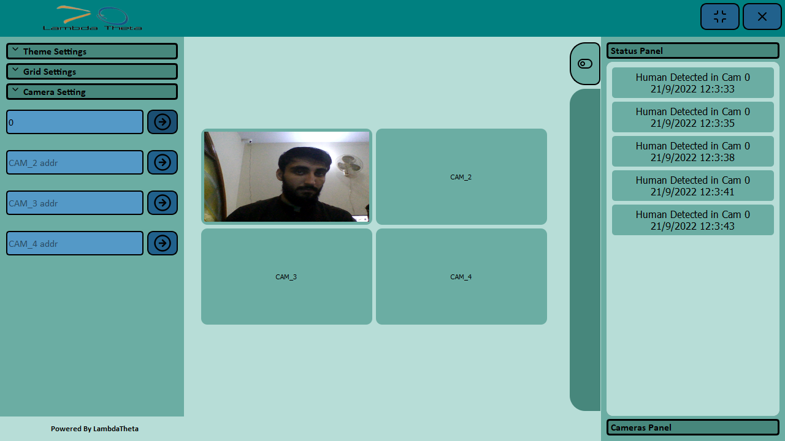

<b>A</b> desktop application that can be used to manage streams from cameras (any camera) and perform human detection on it using stat of the art techninques.It can be used for security purpose where one don't want any human or human activity. It can detect and alert the user as well.

<b>sssohail8611@gmail.com</b>
Contact me using this email address if you would like to discuss the project more.It is not a public project so I can't just share the code here

